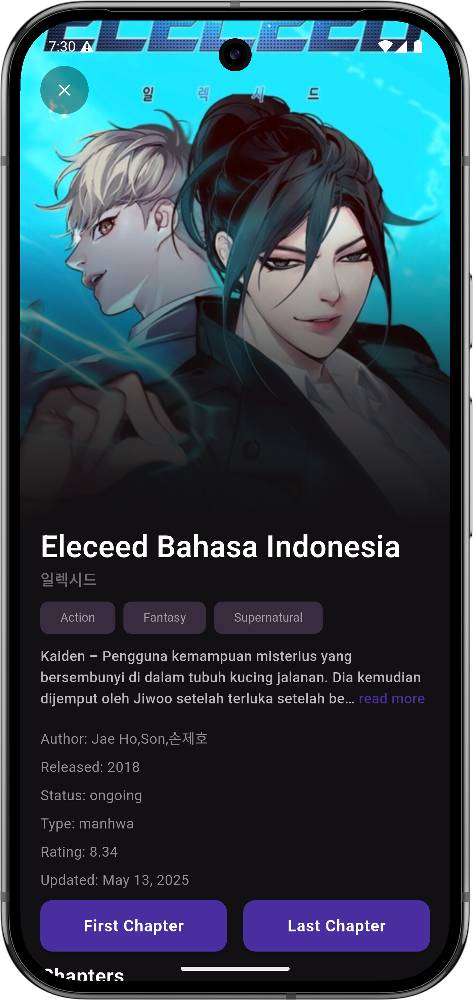
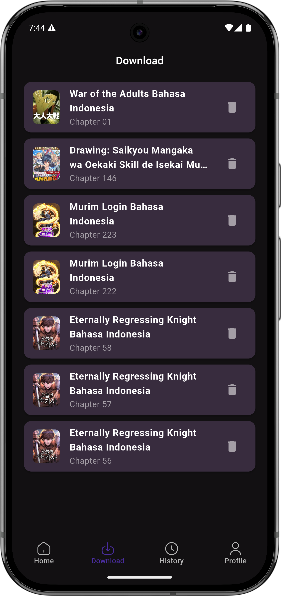
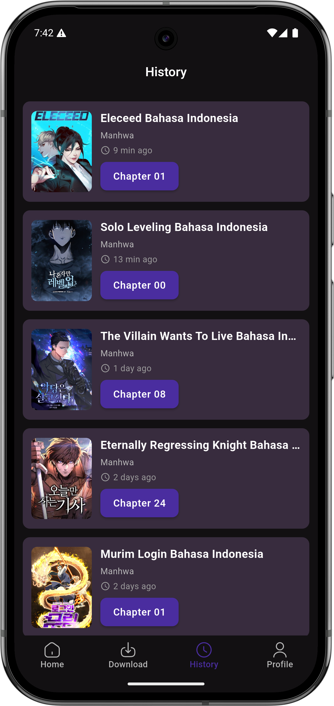
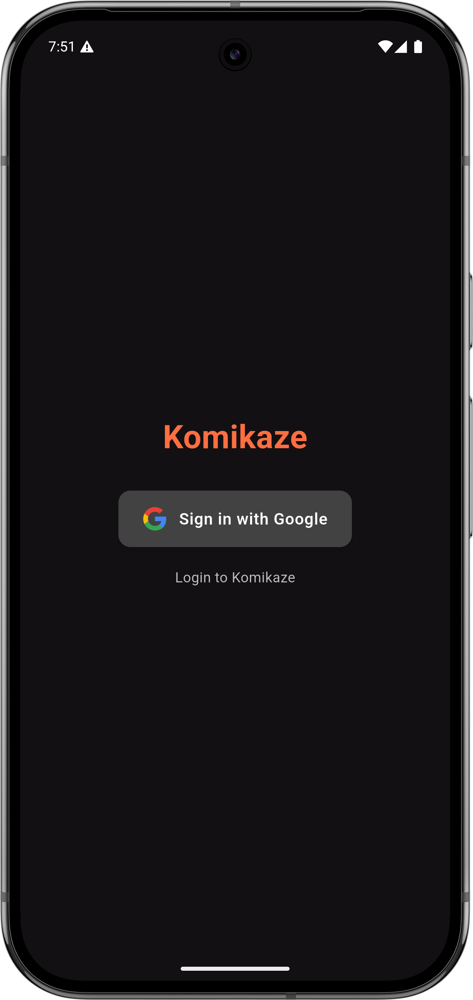
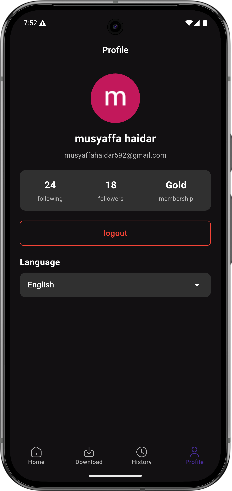
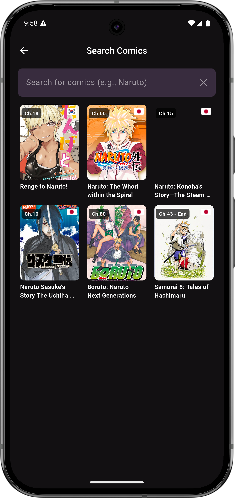
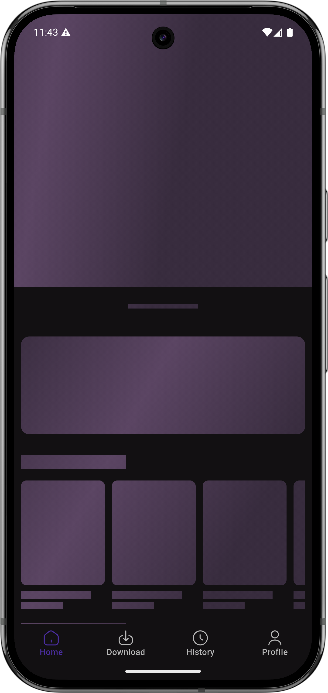
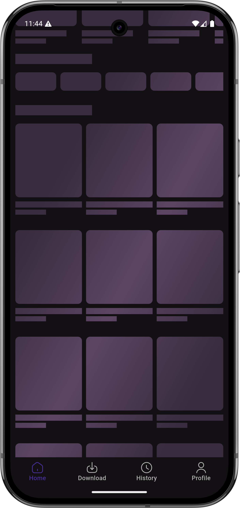
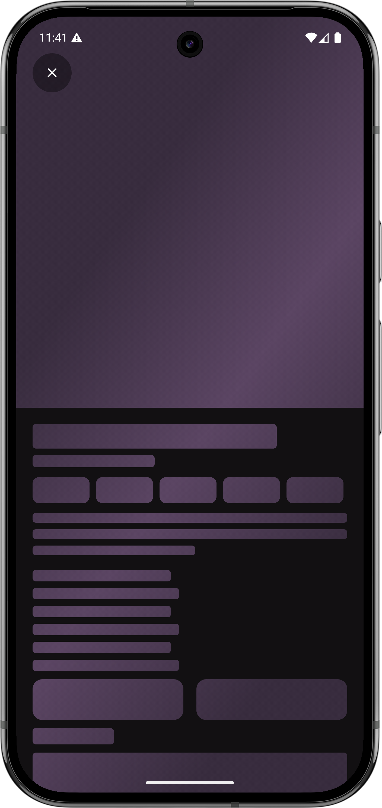

# 📚 Komikaze – Manga, Manhwa & Manhua Reader

**Komikaze** is a modern Flutter-based comic reader app designed for Manga, Manhwa, and Manhua lovers. It features a clean UI, smooth reading experience, and support for both Indonesian and English languages.

---

## ✨ Features

- 🌐 **Multi-language Support** (Indonesian 🇮🇩 & English 🇬🇧)  
  Switch between languages seamlessly in-app.

- 🔍 **Smart Comic Search**  
  Quickly find comics by title, genre, or keyword.

- 📚 **Explore by Categories/Genres**  
  Discover new comics grouped by genre or tags.

- 📥 **Download Chapters**  
  Save chapters locally to read without internet access.


- 🧾 **Reading History**  
  Track comics and chapters you’ve read.

- 👤 **User Profile**  
  Manage your favorite comics and preferences.

- 💬 **Global Chat** *(coming soon)*  
  Interact with fellow readers inside the app.
  
- 🕓 **Continue Reading**   *(coming soon)*  
  Automatically resume from your last read position.

- 🗨️ **Comment System** *(coming soon)*  
  Leave your thoughts and feedback on comics.

- 🌗 **Dark & Light Mode**   *(coming soon)*  
  Choose the theme that fits your reading mood.

---

## 📸 App Screens

| Home | Genre | Comic Detail |
|:----:|:-----:|:------------:|
|  |  |  |

| Chapter | Download | History |
|:-------:|:--------:|:-------:|
|  |  |  |

| Login | Profile | Search |
|:-----:|:-------:|:------:|
|  |  |  |

---

## ⏳ Loading States (Shimmer Skeleton)

| Home Loading | Home Loading | Detail Comic Loading |
|:------------:|:------------:|:--------------------:|
|  |  |  |

---

## 🚀 Installation

```bash
git clone https://github.com/rafsanza-hub/komikaze.git
cd komikaze
flutter pub get
flutter run
